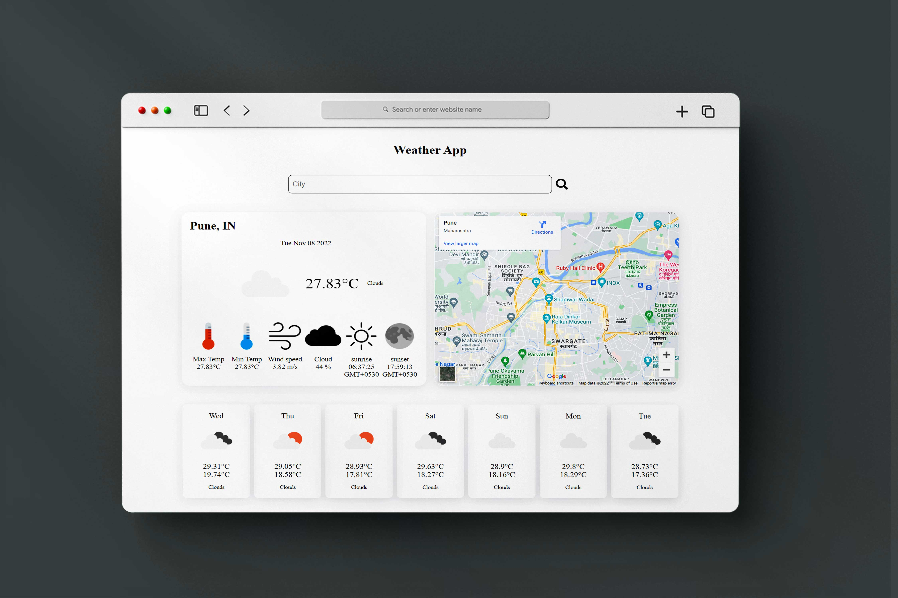

# Personal Portfolio Website

Try to show my work and contribution to developer community.

## Deployed link of project
- <a href="https://polite-basbousa-93e61a.netlify.app/">Weather App</a>
## Deployment

On frontend terminal perform:

```bash
  Open index.html with live server
```


## 🛠 Tech Stack

- Boothstrap
- openweathermap API
- Material UI
- Javascript
- HTML
- CSS
- Local storage

## Functionality

- Get weather details of your location.
- Auto detect current location.
- Show upcoming seven days weather details.
- Show google map of location.


## Website flow for User

- Auto detect current location.

- You can enter you location as well.

- Get information form openweathermap API.

- Show that information in readable format to user.

- Show upcoming seven days weather details.


#### Website Presentation :




## Thank you note
Thank you all who is giving precious time to visit our little creative project which is made with lot of efforts.

_<p align="center"><sub>- Designed by <a href="https://github.com/pratiksontakke">Pratik Sontakke</a> -</sub></p>_